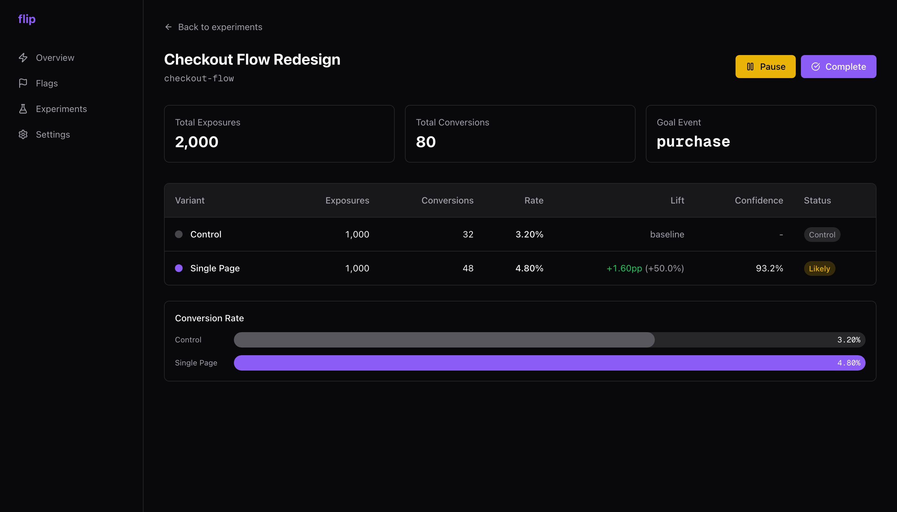

# Flip

Feature flag and A/B testing service with real statistical significance.



## What it does

Create feature flags and run A/B experiments with a dashboard, edge API, and drop-in JS SDK. Deterministic variant assignment via MurmurHash3 means zero flicker. Results page shows conversion rates, lift, confidence intervals, and statistical significance using two-proportion z-tests.

## Built with

- **Next.js** (App Router) + TypeScript
- **Prisma** + PostgreSQL
- **Zod** for input validation
- **MurmurHash3** for deterministic variant assignment
- **Two-proportion z-test** with Wilson confidence intervals

## Features

- Boolean feature flags with instant toggle
- Multi-variant A/B experiments with configurable traffic splits
- Statistical significance engine (z-test, p-values, confidence badges)
- Sub-2KB JS SDK with `sendBeacon` for reliable tracking
- API key management
- Seed script with realistic demo data

## Run locally

```bash
git clone https://github.com/sammii-hk/flip.git
cd flip
npm install
cp .env.example .env   # set DATABASE_URL
npx prisma migrate dev --name init
npx tsx prisma/seed.ts  # creates demo flags + experiments with event data
# copy the DEMO_API_KEY_ID from seed output into .env
npm run dev
```

## SDK usage

```html
<script src="https://your-flip-url.vercel.app/sdk/flip.min.js"></script>
<script>
  const flip = Flip.init({ apiKey: "flip_live_..." });
  const variant = await flip.getVariant("checkout-flow");
  flip.track("purchase");
</script>
```

## API

| Endpoint | Method | Description |
|----------|--------|-------------|
| `/api/v1/decide` | POST | Get variant assignment for a flag/experiment |
| `/api/v1/track` | POST | Record a conversion event |
| `/api/v1/flags` | GET | Bootstrap all flags and running experiments |
